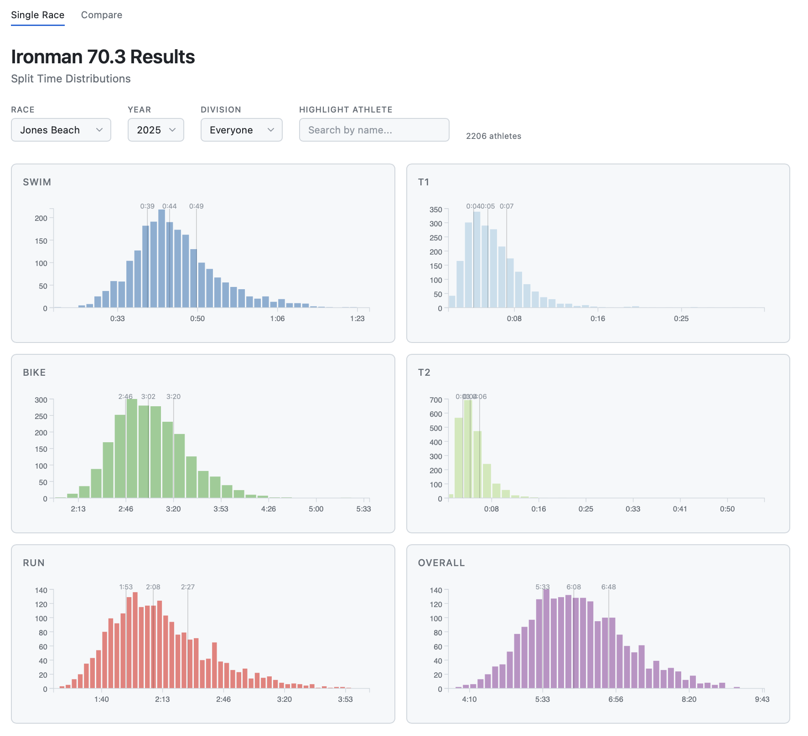
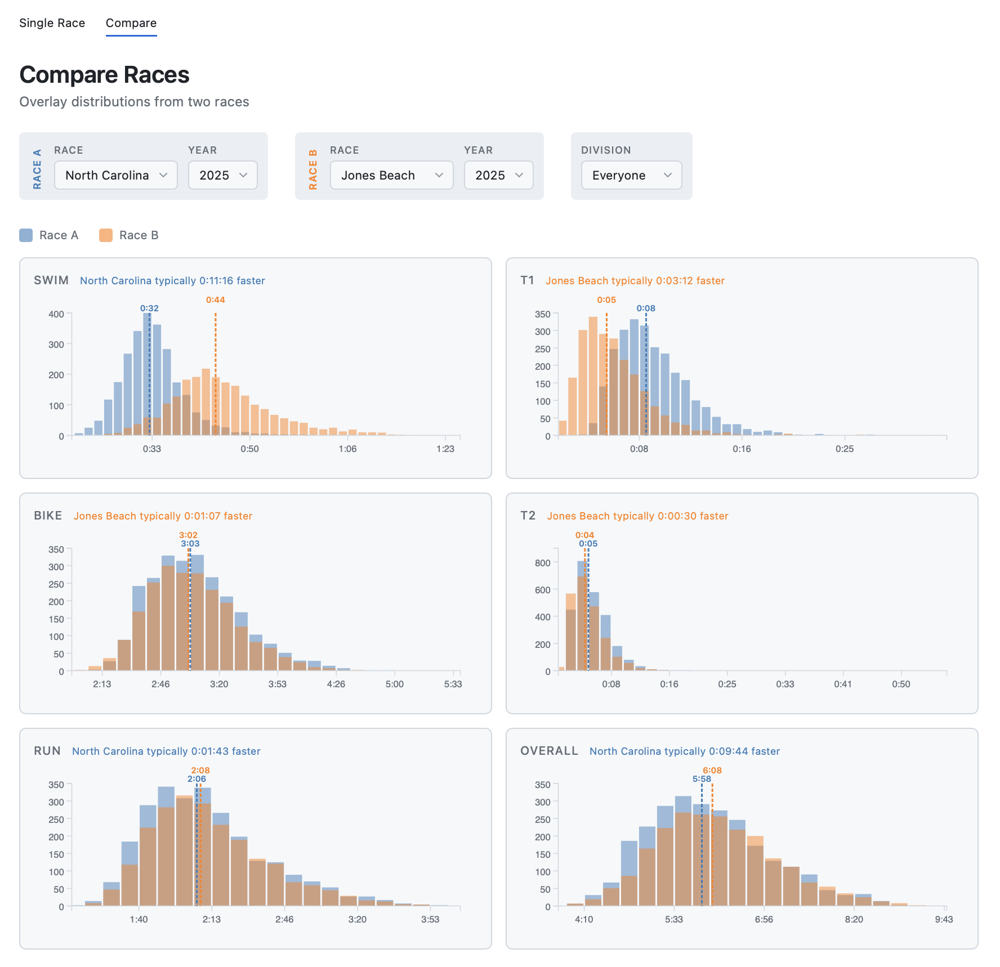

# tri-times

Interactive visualization of Ironman 70.3 triathlon race results. View split time distributions, compare races, and track athlete performance across divisions.





## Features

- **Single Race View**: Histograms for swim, T1, bike, T2, run, and overall times
- **Race Comparison**: Overlay distributions from two different races
- **Division Filtering**: Filter by age group, gender, or view everyone
- **Athlete Search**: Highlight a specific athlete across all charts
- **Quartile Markers**: See 25th, 50th, and 75th percentile times
- **Light/Dark Theme**: Toggle between themes

## Quick Start

```bash
# Clone the repository
git clone https://github.com/jhofman/tri-times.git
cd tri-times

# Start a local server
npm start

# Open in browser
open http://localhost:8080
```

## Adding New Races

Race data is fetched from the Ironman results API using the included scraper (based on [ironman-results](https://github.com/colinlord/ironman-results) by Colin Lord).

```bash
# Fetch results for a single race (interactive)
npm run fetch-results

# Or pass a URL directly
npm run fetch-results -- https://www.ironman.com/races/im703-chattanooga

# Fetch results for ALL 70.3 races (takes a while!)
npm run fetch-all-results

# Update the list of available races from ironman.com
npm run fetch-race-list

# Regenerate the races manifest after adding data
npm run update-manifest
```

CSV files are saved to `results/` and the manifest at `results/races.json` lists available races.

## Project Structure

```
tri-times/
├── index.html          # Single race view
├── compare.html        # Race comparison view
├── races.txt           # List of all 70.3 race URLs
├── css/
│   └── style.css       # Styles with light/dark themes
├── js/
│   ├── shared.js       # Utilities, data loading
│   ├── theme.js        # Theme toggle
│   ├── app.js          # Single race logic
│   └── compare.js      # Comparison logic
├── results/
│   ├── races.json      # Available races manifest
│   └── *.csv           # Race data files
└── scripts/
    ├── scraper.js      # Fetch race results
    ├── fetch-race-list.js  # Update races.txt
    └── update-manifest.js  # Regenerate races.json
```

## Data Format

CSV files contain the following columns:
- Athlete info: Bib Number, Athlete Name, Gender, City, State, Country, Division
- Times: Swim Time, T1 Time, Bike Time, T2 Time, Run Time, Finish Time
- Times in seconds: Swim (Seconds), T1 (Seconds), Bike (Seconds), T2 (Seconds), Run (Seconds), Finish (Seconds)
- Rankings: Overall Rank, Gender Rank, Division Rank, plus per-leg rankings

## Technologies

- [D3.js](https://d3js.org/) v7 for data visualization
- Vanilla JavaScript (no build step required)
- CSS custom properties for theming
- [Font Awesome](https://fontawesome.com/) for icons

## License

MIT
