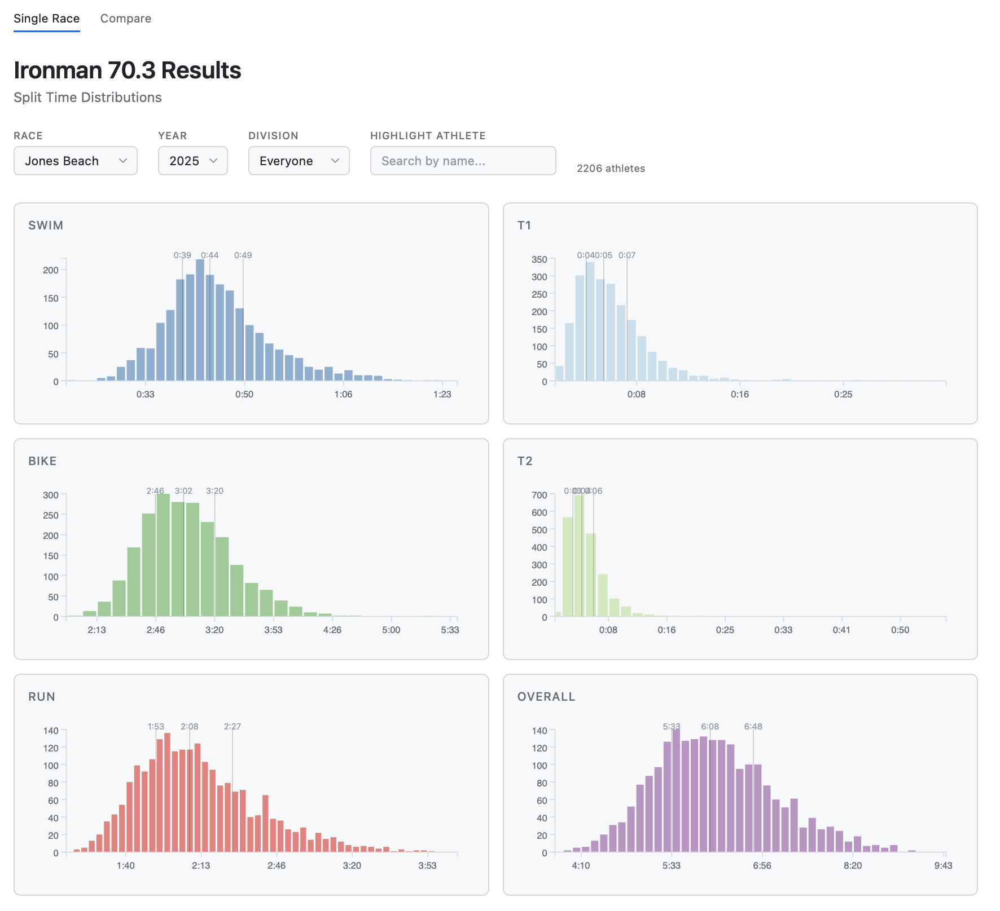
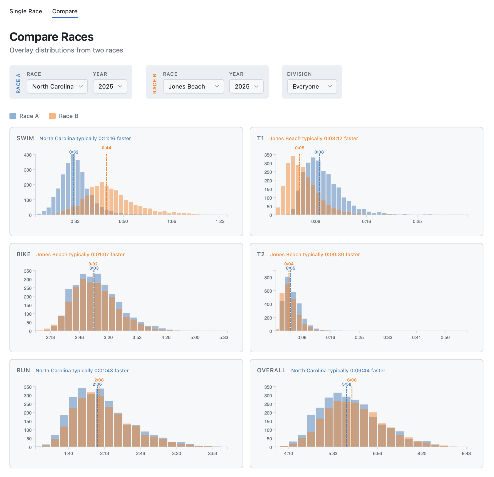

# tri-times

Interactive visualization of Ironman 70.3 triathlon race results. View split time distributions, compare races, browse race stats, look up athletes, and predict race times.





## Features

- **Single Race View**: Responsive split distributions with quartile ranges, pace summaries, and athlete markers
- **Race Comparison**: Normalized overlays for comparing distribution shape across two races
- **Race List**: Sortable table of all races with percentile-based split times (5th–95th)
- **Athlete Search**: Look up any athlete across all races with per-split percentile rankings
- **Race Predictor**: Project an athlete's time in any race using their historical percentile profile
- **Division Filtering**: Filter by age group, gender, or view everyone
- **Shareable URLs**: All page state is reflected in the URL for easy sharing
- **Light/Dark Theme**: Toggle between themes

## Quick Start

```bash
# Clone the repository
git clone https://github.com/jhofman/tri-times.git
cd tri-times

# Start a local server
npm start

# Open in browser
open http://localhost:8080
```

## Adding New Races

Race data is fetched from the Ironman results API using the included scraper (based on [ironman-results](https://github.com/colinlord/ironman-results) by Colin Lord).

```bash
# Fetch results for a single race (interactive)
npm run fetch-results

# Or pass a URL directly
npm run fetch-results -- https://www.ironman.com/races/im703-chattanooga

# Fetch results for ALL 70.3 races (takes a while!)
npm run fetch-all-results

# Update the list of available races from ironman.com
npm run fetch-race-list

# Fetch missing current-year results for active and previously tracked races
npm run fetch-new-results

# Regenerate races.json, race-stats.json, and athlete index shards
npm run update-manifest
```

CSV files are saved to `results/` and the manifest at `results/races.json` lists available races.

### Weekly data updates

The **Update race data** GitHub Actions workflow runs every Monday and can also
be started manually from the Actions tab. It refreshes `races.txt`, fetches
missing current-year results for the union of active races and races already
represented in the local CSV archive, regenerates derived data when needed,
and opens or updates
`automation/weekly-race-update` as a pull request for review.

To let the built-in `GITHUB_TOKEN` open that pull request, enable:
**Settings → Actions → General → Workflow permissions → Allow GitHub Actions
to create and approve pull requests**.

For a full historical refresh, run `npm run fetch-all-results` locally before
`npm run update-manifest`.

## Project Structure

```
tri-times/
├── index.html              # Single race view
├── compare.html            # Race comparison view
├── races.html              # Race list with sortable stats
├── athlete.html            # Athlete search
├── predict.html            # Race time predictor
├── races.txt               # List of all 70.3 race URLs
├── css/
│   └── style.css           # Styles with light/dark themes
├── js/
│   ├── shared.js           # Utilities, data loading, caching
│   ├── nav.js              # Shared navigation and inline icons
│   ├── theme.js            # Theme toggle
│   ├── histogram.js        # Shared histogram renderer
│   ├── app.js              # Single race histograms
│   ├── compare.js          # Race comparison logic
│   ├── races.js            # Race list table
│   ├── athlete-lookup.js   # Athlete search with sharded index
│   └── predict.js          # Race predictor with interpolation
├── .github/workflows/
│   └── update-races.yml    # Weekly current-year data update PR
├── results/
│   ├── races.json          # Race manifest (names, years)
│   ├── race-stats.json     # Pre-computed percentile stats per race
│   ├── athletes/           # Full athlete records (by first-name initial)
│   ├── athlete-search/     # Compact name search index (by token prefix)
│   └── *.csv               # Race data files
└── scripts/
    ├── scraper.js          # Fetch race results
    ├── fetch-race-list.js  # Update races.txt
    └── update-manifest.js  # Regenerate races.json, stats, and athlete index
```

## Data Format

CSV files contain the following columns:
- Athlete info: Bib Number, Athlete Name, Gender, City, State, Country, Division
- Times: Swim Time, T1 Time, Bike Time, T2 Time, Run Time, Finish Time
- Times in seconds: Swim (Seconds), T1 (Seconds), Bike (Seconds), T2 (Seconds), Run (Seconds), Finish (Seconds)
- Rankings: Overall Rank, Gender Rank, Division Rank, plus per-leg rankings

## Technologies

- [D3.js](https://d3js.org/) v7 for data visualization
- [Choices.js](https://choices-js.github.io/Choices/) for searchable dropdowns
- Vanilla JavaScript (no build step required)
- CSS custom properties for theming
- Inline SVG icons

## License

MIT
